

# 🐾 Paws Perfect
### *Your Companion Connection Starts Here*

**A UX/UI design concept for a pet adoption and care app — helping individuals find animal companions that fit their lifestyle while connecting them with trusted pet care services.**

---

## 📱 High-Fidelity Screens

<table>
  <tr>
    <td align="center"><b>🏠 Home</b></td>
    <td align="center"><b>🐶 Adoption List</b></td>
    <td align="center"><b>🛁 Services</b></td>
    <td align="center"><b>👥 Community</b></td>
    <td align="center"><b>💬 Chat</b></td>
  </tr>
  <tr>
    <td>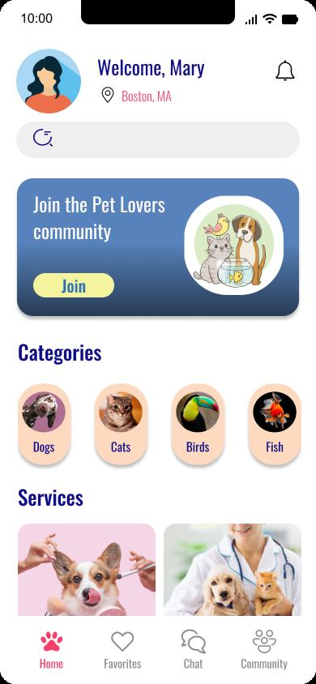</td>
    <td>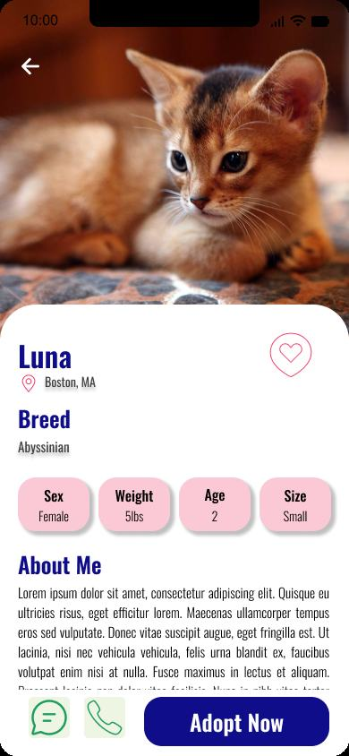</td>
    <td>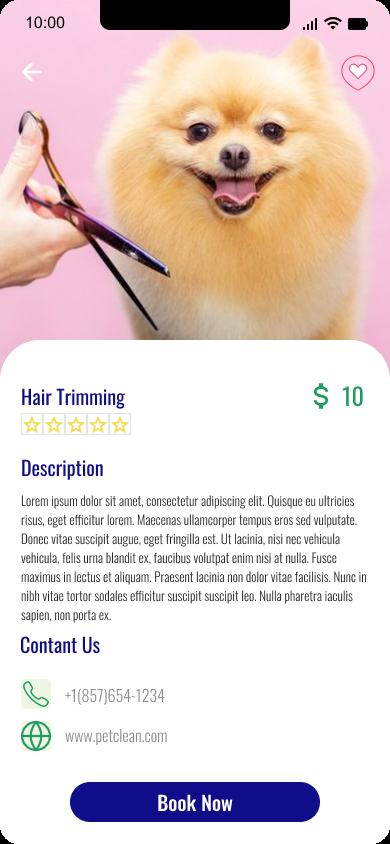</td>
    <td>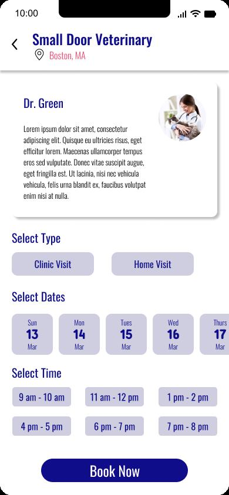</td>
    <td>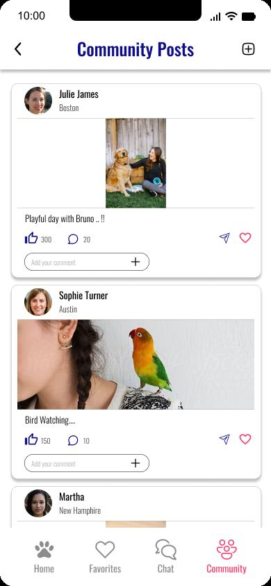</td>
  </tr>
</table>

---

## 💡 The Problem

Many individuals struggle to find an animal companion that fits seamlessly into their lifestyle and living situation due to:

- **No personalized guidance** on which pet suits their lifestyle, work schedule, or living space
- **Uncertainty about pet care** requirements and long-term commitment
- **Limited access** to adoption resources in one place
- **No direct communication** with adoption centers or care professionals

These pain points lead to compatibility issues, overwhelming decisions, and hesitation towards pet ownership.

---

## 🔍 Research Process

### User Interviews

Conducted user interviews to understand real pet owner needs before designing anything. Key interview questions included:

- *Are there specific lifestyle factors that influence your decision to own a pet (work schedule, family dynamics, living space)?*
- *Have you encountered challenges or concerns related to pet ownership in the past?*
- *What worked well with existing apps, and what felt missing or could be improved?*

### Empathy Map

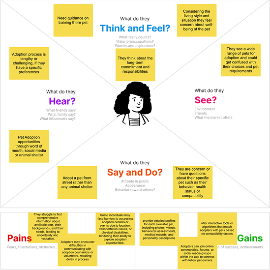

### Key Insight from Research

> **POV Statement:** A person going on tour without their pet needs to find a reliable pet sitting home — so they should get access to local pet sitters, boarding facilities, and care professionals with convenient booking, payment options, background checks, and reviews.

---

## ✨ Key Features Designed

### 🐾 Pet Adoption with Personalized Matching
Browse pets by category with detailed profiles — helping users find companions that match their lifestyle, space, and preferences. Add to favorites for easy comparison.

### 🛁 Pet Care Service Booking
Book appointments directly with groomers and veterinarians — view nearby vets, check available dates and times, and confirm bookings in-app.

### 💬 In-App Chat
Direct messaging with adoption centers or other users — making it easy to ask questions, get support, and make informed adoption decisions before committing.

### 👥 Community Page
A social feed where pet owners share stories, posts, and experiences — creating a community of engaged pet lovers that helps new owners feel supported.

### 🔍 Search & Filter
Search for pets by category and filter by type — making discovery fast and relevant to each user's preferences.

---

## 🎨 Design Process

### 1. User Research & Empathy Mapping
Conducted user interviews to validate assumptions about pet ownership behavior, concerns, and expectations — ensuring the app addresses real-world needs, not assumptions.

### 2. Hand Sketches

Low-fidelity paper sketches to rapidly explore layout ideas across all features before committing to digital wireframes.

<table>
  <tr>
    <td>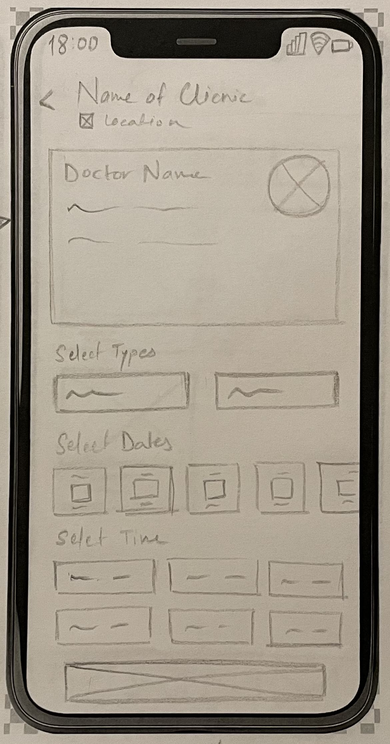</td>
    <td>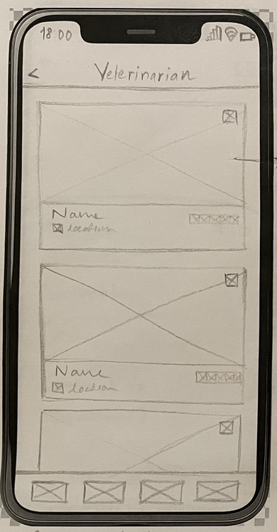</td>
  </tr>
</table>

### 3. Wireframes

Low-fidelity digital wireframes covering Home, Favorites, Adoption List & Detail, and Chat pages — focused on layout, navigation flow, and information hierarchy before adding visual design.

<table>
  <tr>
    <td align="center"><b>Home</b></td>
    <td align="center"><b>Adoption List</b></td>
    <td align="center"><b>Services</b></td>
    <td align="center"><b>Chat</b></td>
  </tr>
  <tr>
    <td>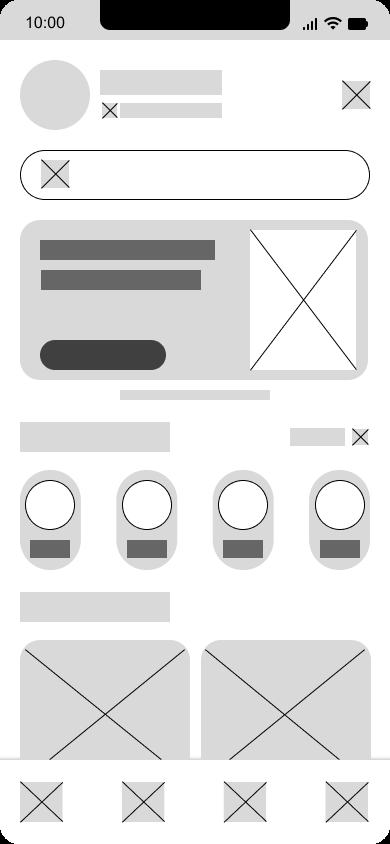</td>
    <td>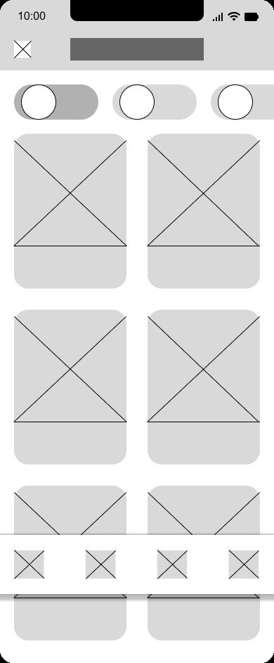</td>
    <td>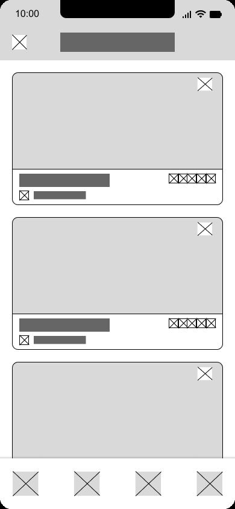</td>
    <td>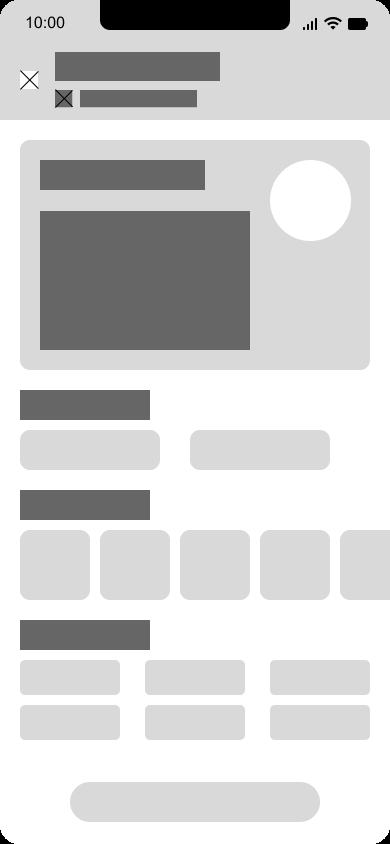</td>
  </tr>
</table>

### 4. High-Fidelity Prototypes

Final colored prototypes with real images, typography, and a warm orange color palette — chosen to evoke warmth, care, and the emotional connection between pets and their owners.

### 5. Usability Testing

Conducted usability testing with **4 participants** across 4 core task flows:

| Task | Flow |
|---|---|
| Task 1 | Navigate to Home Page and explore |
| Task 2 | Browse Adoption List and post details |
| Task 3 | Navigate to Services Page and book |
| Task 4 | Navigate to Community Page |

**Key feedback from participants:**

- ✅ "Nice home page design. Good use of color scheme"
- ✅ "The chat feature with adoption center is very useful"
- ✅ "Booking appointment is very convenient"
- ✅ "Finding nearby vet and seeing available time and date is a nice feature"
- ✅ "Seeing community page like social media is good"
- 💬 "Give real pictures for category section instead of cartoon images"
- 💬 "Could have a training feature for pets"
- 💬 "Could have an explore or informative section on pets like blogs"
- 💬 "Comments by other users can be made available"

---

## 🛠️ Tools Used

---

## 💭 Reflection

**What went well**
- User interviews gave clear, validated direction before any design work began
- Built high-quality layouts with a complete, working user flow
- Learned the end-to-end UX/UI design process — from research to prototype

**What could be improved**
- Conduct more user interviews with real-world participants beyond the classroom
- The design process was time-intensive — need deeper hands-on skills in animations and micro-interactions
- More services and features (pet training, blog section, community comments) identified from usability feedback

---

## 🔗 Live Prototype

👉 **[Click to view the interactive Figma prototype](https://www.figma.com/proto/fhSxY4jqSkUjfwUTW0r1oJ/PrachiNavale_Spring24?page-id=409%3A2&node-id=409-684&t=DwWBhTPUz9fQuR2f-0&scaling=scale-down&content-scaling=fixed&starting-point-node-id=409%3A684)**

---

## 👩‍💻 Author

**Prachi Navale** — Frontend Engineer · MS Information Systems, Northeastern University

---

  <i>Designed as part of a UX Design course — Spring 2024, Northeastern University</i>
    
Copyright © 2024 Prachi Navale · All rights reserved.

